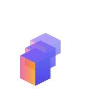

  

# Chronicle

## The Problem
The 2024 State of Developer Productivity report found "time spent gathering project context" tied for the biggest productivity leak at 26% Planview.

## The Solution
An automatic knowledge capture system that:

- Monitors dev activity (Git, IDE, Slack, Jira) to capture context
- Extracts "why" decisions were made from PR discussions, Slack threads, etc.
- Builds searchable knowledge graph of project decisions
- Surfaces relevant context when starting new work
- Works locally/self-hosted (privacy-first)

Chronicle is a developer context capture and knowledge base system.

## Features

### Open Source
Local-only, basic context capture

### Commercial

Team sync, advanced search, AI summarization, more integrations

## Implementation

Core components:
- Data collectors / Connectors
- Central data store
    - SQLite for structured data
    - ChromaDB for vector data
- Knowledge Extraction
    - BYOK LLMs to extract structured knowledge
- Query interface
    - BYOK natural language search
